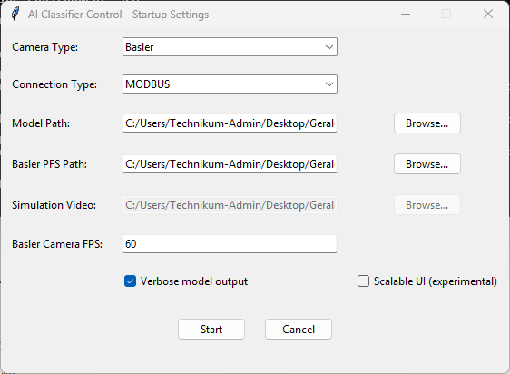
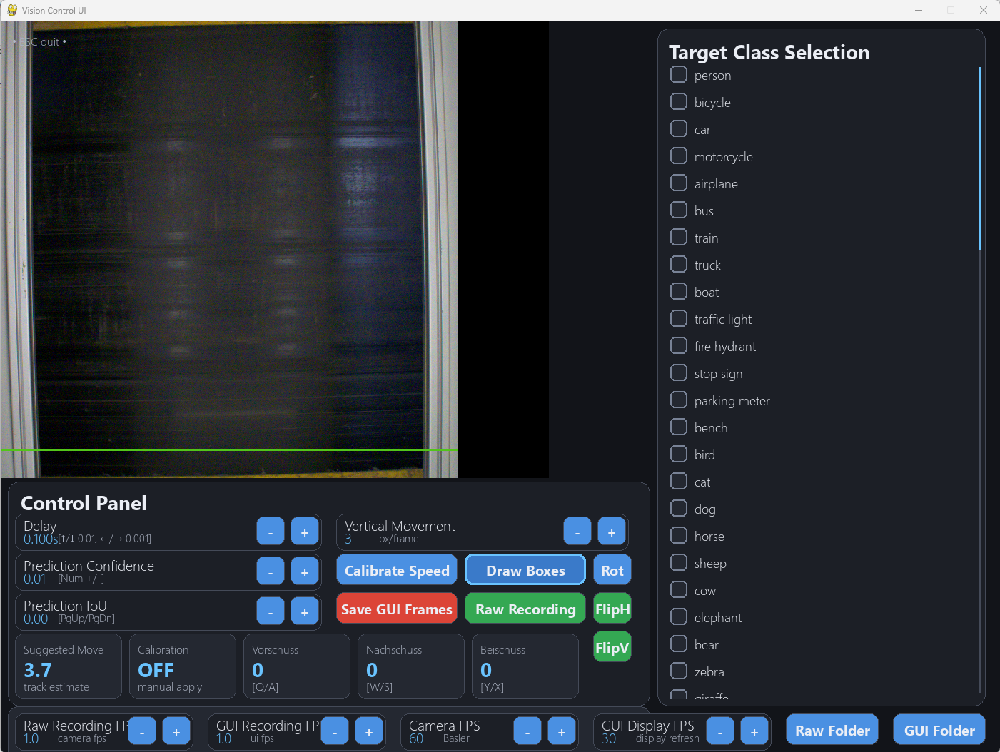

# SenSoRTC – Real-Time AI Classification & Sorting Control

SenSoRTC is a real-time industrial AI classification and sorting platform designed for automated material detection, classification, and pneumatic nozzle actuation.

The system combines:

* Ultralytics YOLO object detection
* NIR (Near Infrared) line-scan classification
* Basler, USB, simulated, and mvIMPACT camera support
* Real-time nozzle control via UDP, Modbus, Arduino Serial, or simulation
* Adjustable runtime parameters through a graphical user interface
* Raw image and classification recording
* Automatic camera recovery and process supervision

The software is designed for high-speed sorting applications such as recycling, agricultural products, food inspection, and industrial material separation.

---

# Features

## Camera Support

* Basler industrial cameras
* USB cameras
* Simulated video sources
* mvIMPACT NIR line-scan cameras

## AI Classification

### RGB Object Detection

* Ultralytics YOLO integration
* Configurable confidence and IoU thresholds
* Real-time bounding box visualization
* Multi-class target selection

### NIR Classification

* Real-time spectral classification
* Rolling line-buffer visualization
* Class-based nozzle activation
* Configurable background thresholding

## Sorting Control

* UDP nozzle controllers
* Modbus nozzle controllers
* Arduino serial controllers
* Fully simulated mode

## Runtime Configuration

* Adjustable delay compensation
* VORSCHUSS (forward expansion)
* NACHSCHUSS (rear expansion)
* BEISCHUSS (lateral expansion)
* Vertical movement compensation
* Rotation and image flipping
* Recording settings

## Recording

* Raw camera images
* GUI screenshots
* NIR spectral data chunks
* Timestamped recordings

## Reliability

* Multiprocessing architecture
* Automatic camera reconnection
* Queue-based communication
* Runtime settings persistence

---

# Architecture

```text
Camera
   │
   ▼
Producer Process
   │
   ├── Image Acquisition
   ├── AI Inference
   ├── Mask Generation
   └── Display Rendering
   │
   ▼
Mask Queue
   │
   ▼
Consumer Process
   │
   ├── Delay Compensation
   └── Nozzle Control
   │
   ▼
Sorting Hardware
```

---

# Startup Configuration

The software starts with a dedicated configuration interface.



From this screen you can configure:

* Camera type
* AI model
* Communication interface
* Video source
* NIR classifier
* Recording options
* Runtime parameters

---

# Classification Interface

After startup the main control interface provides real-time monitoring and parameter adjustment.



The interface includes:

* Live camera image
* Detection visualization
* Nozzle activation mask
* Class selection
* Confidence and IoU controls
* Delay compensation
* Recording controls
* Vertical movement calibration
* Camera orientation controls

---

# Supported Camera Modes

## Basler

Industrial area-scan cameras using the Pylon SDK.

## USB

Generic USB cameras using OpenCV.

## Simulated

Offline testing using video files.

## mvIMPACT NIR

Near-infrared line-scan cameras with spectral classification.

---

# Installation

## Requirements

Python 3.10+

Required packages include:

```bash
pip install ultralytics
pip install opencv-python
pip install numpy
pip install pyyaml
pip install pypylon
```

Additional dependencies may be required depending on the camera and controller hardware.

---

# Running the Application

```bash
python SenSoRTC.py
```

The startup configuration window will open automatically.

---

# Configuration Files

## Runtime Settings

```text
runtime_settings.yaml
```

Stores:

* Detection thresholds
* Recording settings
* Target classes
* Motion compensation
* UI preferences

## Camera Settings

USB and NIR cameras can be configured using dedicated YAML files.

---

# Recording Output

Recorded data is stored in:

```text
Recordings_Camera/
Recordings_GUI/
```

NIR raw spectral recordings are automatically chunked and timestamped.

---

# Industrial Applications

* Plastic sorting
* Food inspection
* Agricultural sorting
* Waste management
* Material recovery facilities (MRF)
* Conveyor belt inspection
* Quality control systems

---

# License

Specify your license here.

Example:

MIT License

```
```

